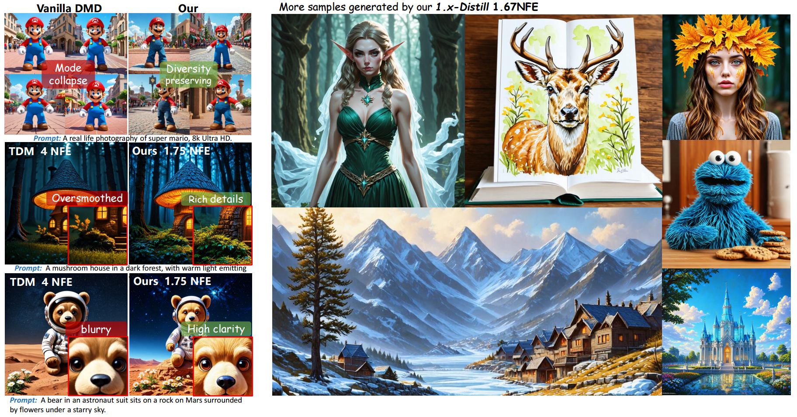
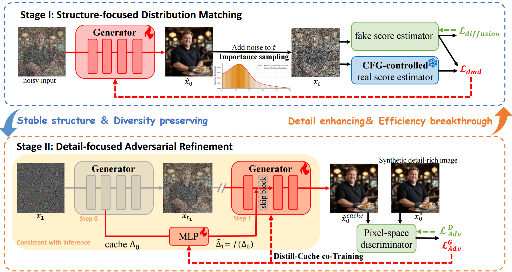

<div align="center">

<h1><span class="gradient-title">🌈 1.x-Distill</span></h1>
<h3>Breaking the Diversity, Quality, and Efficiency Barrier in Distribution Matching Distillation</h3>

<a href="https://thu-accdiff.github.io/1.x-distill-page/">
  
</a>
<a href="#">
  
</a>
<a href="https://github.com/THU-AccDiff/1.x_distill">
  
</a>

</div>

<p align="center">
  
</p>

<div align="center">
<strong>This is the official code repo of 1.x-Distill, is a stagewise distillation framework for diversity, high-quality and efficient few-step generation, with support for fractional-step inference and MLP-based cache acceleration.</strong>
</div>


> The current repository already provides the core training and inference pipeline used in our project, while some engineering details and auxiliary components are still under refinement.

---

## Overview



Few-step diffusion distillation via distribution matching often suffers from diversity loss, quality degradation, and limited speedup from step reduction alone.

**1.x-Distill** addresses these issues with:
- **stagewise distillation** for structure and detail,
- **cache-aware training** for faster **fractional-step generation** .
---

## Repository Structure

```text
.
├── common/           # Common utility functions
├── configs/          # YAML configuration files for training/inference
├── inference/        # Inference scripts
├── models/           # Model definitions (e.g., discriminator and related modules)
├── scripts/          # Shell scripts for launching experiments
├── train/            # Core training code
├── README.md
└── requirements.txt  # Main Python dependencies
```

---

## Environment Setup

We recommend creating a clean Python environment before installation.

```bash
pip install -r requirements.txt
```

Please ensure that your environment is properly configured for distributed training if you plan to run multi-GPU experiments.

---

## Preparation

Before running training or inference, please review the configuration files under `configs/` carefully.

In particular, you should verify:

* pretrained model paths,
* dataset paths,
* output directories,
* distributed training settings,
* and stage-specific hyperparameters.


---

## Training

The training pipeline is divided into multiple stages.
Please check the corresponding shell scripts and config files before launching any experiment.

### Single-node training

```bash
cd code/

# Stage I: structure-focused distillation
bash scripts/run_torch_sd3m_stage1.sh

# Stage II: detail-focused refinement
bash scripts/run_torch_sd3m_stage2.sh
```

### Notes

* Make sure all model checkpoints and training data required by the config files are prepared in advance.
* Depending on your hardware setup, you may need to modify launcher arguments, batch size, gradient accumulation steps, or distributed settings.
* We strongly recommend reading the corresponding config file before starting a run.

---

## Inference

We provide example scripts for both standard distilled sampling and cache-accelerated 1.x-step sampling.

```bash
# Sampling with the distilled model without cache acceleration
python inference/inference_distill.py

# Sampling with the 1.x-Distill model using MLP cache acceleration
python inference/inference_distill_mlpcache.py
```

### Inference Modes

* `inference_distill.py`: standard few-step sampling with the distilled model.
* `inference_distill_mlpcache.py`: cache-accelerated sampling for reduced effective computation (1.x-step inference).

Please update the relevant checkpoint paths and runtime arguments before execution.

---


<!-- ## Citation

If you find this repository useful in your research, please cite our work:

```bibtex
@article{your_entry_here,
  title   = {1.x-Distill: ...},
  author  = {...},
  journal = {...},
  year    = {...}
}
``` -->


